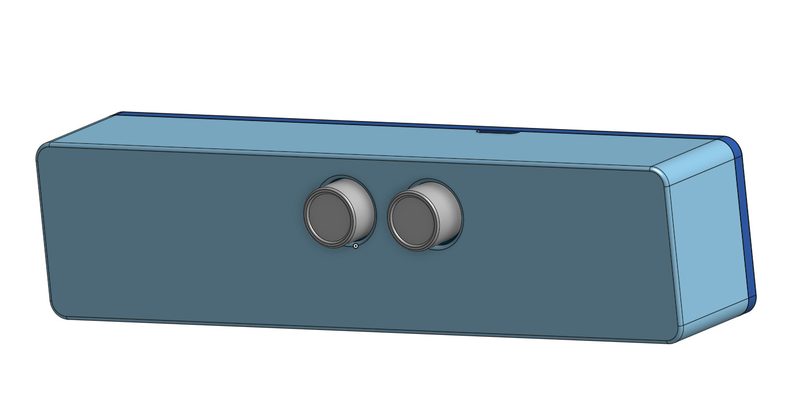
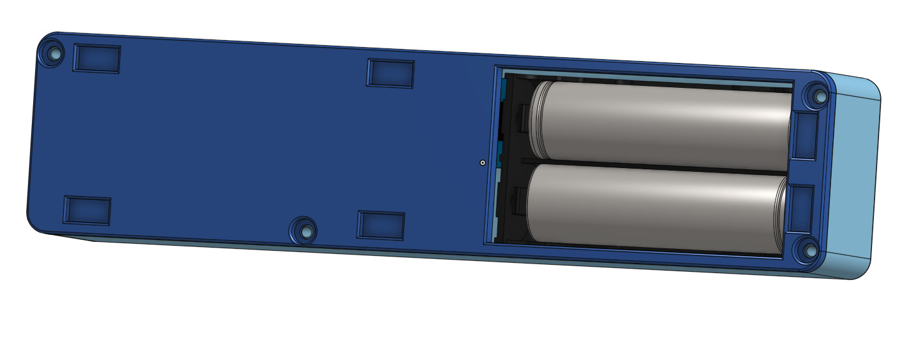
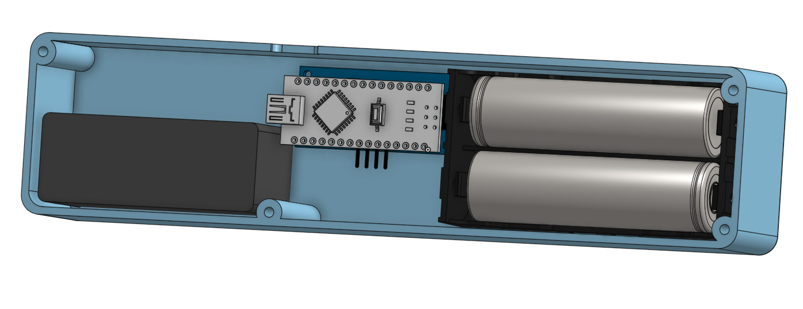

# ELWireProximityController
A simple ultrasonic proximity EL wire power switch used on Star Trek Cruise 2019

Uses an Arduino Nano, HC-SR04, N-CH mosfet, an EL wire power supply and 2 LiPo battery pack.

Using Onshape.com for 3D CAD, [ELWireProximityControllerEnclosure](https://cad.onshape.com/documents/152d838213b45c235125690d/w/45181500c3b32f5816f8d2e8/e/04f3397dea0e814da89736f6)

References

 * [Ultrasonic Sensor HC-SR04 and Arduino Tutoria](https://howtomechatronics.com/tutorials/arduino/ultrasonic-sensor-hc-sr04/)
